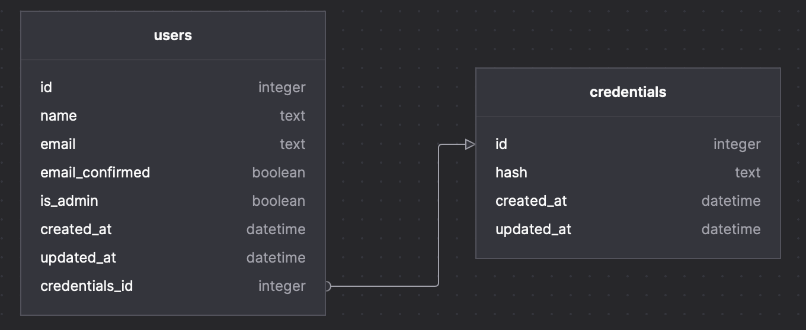
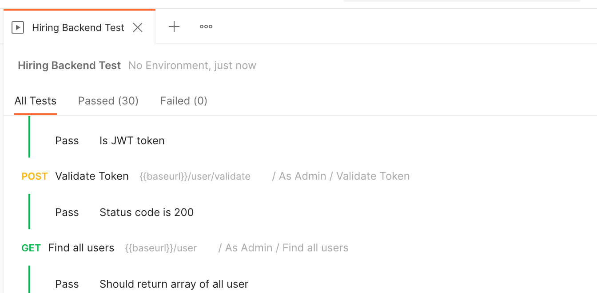

# Keleya Skill-Check

## Backend

The task here is to finish the provided 'barebone' backend by implementing all endpoints and required functionality, and setting up the database following these requirements. The goal of this 'project' is to end up with a working REST API with CRUD endpoints for a simple user management, paired with authorization and authentication methods.

For the backend we are using two modern frameworks, [NestJS](https://docs.nestjs.com/) and [Prisma](https://www.prisma.io/docs/getting-started) running on Node 14. To make the database setup as simple as possible, we will use a SQlite DB. One part of this task will thus be, to familiarize yourself with the technology stack.

The repository as provided throws NotImplementedException() for the missing functions, as well as misses the data structures and database.

### Types

Data is being transferred between functions using Data Transfer Objects. This need to be implemented in accordance with the data model. Optionally, data validation should be implemented as well to assure that valid data is being sent into the application.

### Database

The database should follow this schema:


Command lines:

- `npx prisma migrate dev` for migration
- `npx prisma db seed` for seeding

### Endpoints

- GET /user should query for users with these optional filtering parameters:
  - `limit` Limit the number of results returned
  - `offset` Skip the first n results
  - `updatedSince` Return only items which were updated since Date.
  - `id` An Array of id(s) to limit the query to
  - `name` a LIKE search for names
  - `credentials` include the related credentials in result
  - `email` search for matching email
- GET /user/:id should return one specific user with that id
- (public) POST /user should create a new user with credentials
- PATCH /user should update a user if it exists and should update credentials if they exist IF the user has not been deleted previously
- DELETE /user marks the user as deleted and also removes related credentials rows, but does NOT remove the user row itself
- (public) POST /user/authenticate authenticates the user with an email/password combination and returns a boolean
- (public) POST /user/token authenticates the user with an email/password combination and returns a JWT token
- (public) POST /user/validate validates a Bearer token sent via authorization header and returns a boolean

### Security

- Endpoints marked (public) should allow access without authorization
- Endpoints **not** marked (public) should check JWT tokens and map to users
- Health Check endpoints should be public and no JWT should be required
- Non-public endpoints called by Admin users should allow requests to modify all users, while regular users should locked into their own user - they are only allowed to work on their own user id
- Passwords need to be hashed and salted

### Testing

- If possible, unit tests should check the functionality of the various endpoints and services
- Alternatively, discuss why certain tests were not implemented, necessary or useful, or suggest a test environment

### Extra

- Discuss improvements to the data models or endpoints
- Feel free to suggest other solutions to implement similar projects (but for this skill check, do use the given tech stack as provided here)

### How to do the skill check

- Fork this repository
- Make modifications as you see fit
- Add all your notes into this readme
- Send us the link to your fork
- Tell us how long it took you to get the repository to the state you sent us - remember: it's ok to take time if it's done properly.
- Import Hiring Backend Test.postman_collection.json into the latest Postman client and run the collection tests. Depending on how you seed your database, some tests may need to be adjusted for ids. Please take a screenshot of the results like this one:
- 
- Send us this screenshot as well as the export of your postman tests.
- the following should run without errors:

```
yarn
npx migrate reset
yarn test
```

### Your Notes Below Here
### Types

- I also used Dtos for API responses

### Endpoints

- REST API convention recommends to use /users instead of /user
- I have decided to separate the non-public endpoints for admins and other users, for example the update API
- I have decided to make the 'create user' API non-public, only admins are able to create users (both admin and non-admin users)
- You can create an admin user by seeding, and login with that user, then you will be able to create users with API
- I didn't use "guards" globally, so I don't need to mention public endpoints as "IS_PUBLIC", don't need any Authentication or Authorization
- SwaggerUI is also available http://localhost:3000/api/

* GET /users:
  request:

  - `limit` Limit the number of results returned, default can be found in constants
  - `offset` Skip the first n results, default can be found in constants
  - `sortBy` I used sortBy for sorting user by id, name or email (default:id)
  - `sort` I user sort for sorting asc or desc (default:asc)
  - `updatedSince` Return only items which were updated since Date.
  - `id` An Array of id(s) to limit the query to
  - `name` a LIKE search for names
  - `credentials` include the related credentials in result => I think it doesn't make sense for someone to know the users password and use that to filter them, so I removed it.
  - `email` search for matching email
  - `email_confirmed` I used this for return users with email_confirmed = true or false
  - `is_admin` I used this for return users with is_admin = true or false
  - `includeDeleted` I added the "deleted" parameter to the users schema to make it easier to monitor deleted users. When the deleted column is set to true in the delete API, we can see these users by passing this flag.
    response:
  - I added totalCount to response for pagination, so the response type is a class called UserListResponseDto
  - Finally I used a Serializer to serialize the response data
    rules:
  - It's not a public endpoint, so we need Authentication and Authorization
  - I used AuthGuard and RolesGuard to Authorize users

* GET /users/:id should return one specific user with that id
  request:

  - `id` from params should be userId (integer)
    response:
  - It returns a user if exist, it also returns deleted user, maybe admins need to find them
  - The response type is UserSingleResponseDto which includes user as a key and user information as value
  - I used Serializer too, one of the purposes is removing sensitive data like password from the response
    rules:
  - It's not a public endpoint, so we need Authentication and Authorization
  - I used AuthGuard and RolesGuard to Authorize users

* POST /user should create a new user with credentials
  request:

  - `name` is required, it should be at least 3 chars
  - `email` is required, it should matches the @IsEmail decorator from class-validator
  - `password` is required, it should matches a regex, this regex enforces that the password must contain at least one uppercase letter, one lowercase letter, one digit, and one special character, and be at least 8 characters long. If any of the validation fails, an appropriate error message will be returned
    response:
  - The response is exactly like findUnique response
    rules:
  - It's a public endpoint, so it does not need any Authentication or Authorization

* PATCH /user should update a user if it exists and should update credentials if they exist IF the user has not been deleted previously
  request:
  response:
  rules:

* DELETE /user marks the user as deleted and also removes related credentials rows, but does NOT remove the user row itself
  request:

  - `id` from params should be userId (integer), it does not need a Dto
    response:
  - If user exists it returns null with status code 200, if not returns a not found exception
    rules:
  - It's not a public endpoint, so we need Authentication and Authorization
  - I used AuthGuard and RolesGuard to Authorize users

* (public) POST /user/authenticate authenticates the user with an email/password combination and returns a boolean
  request:
  - email
  - password
    response:
    -It returns a boolean field "
*
* (public) POST /user/token authenticates the user with an email/password combination and returns a JWT token
* (public) POST /user/validate validates a Bearer token sent via authorization header and returns a boolean

### Command lines:

- `yarn` for installing packages
- `npx prisma migrate dev` for migration
- `npx prisma db seed` for seeding
  - In seed file You can create three different users, the first one is an admin
- `yarn start:dev` for running the project
